# CIMAS – Cybercrime Incident Management & Awareness System

## 📌 Overview

CIMAS is a secure and centralized platform for reporting, tracking, and managing cybercrime incidents. It empowers victims to submit complaints and evidence, while enabling investigators to access case details, assign tasks, and track progress efficiently.

The system also provides:

* **Location-based analytics** to identify high-risk areas
* **Awareness Hub** with educational content on safe online practices

### Tech Stack

* **Frontend:** React, JavaScript
* **Backend:** Django, PostgreSQL
* **Security:** Password hashing, role-based access control, safe file handling

---

## ⚡ Core Features

* 👥 Role-based user access (victims, investigators, admins)
* 📝 Cybercrime incident reporting
* 📂 Evidence submission & secure storage
* 🔍 Investigator assignment & case tracking
* 🗺️ Crime mapping with location-based insights
* 📚 Awareness Hub for public digital safety

### 🔮 Planned Enhancements

* Mobile application support
* AI-based crime pattern detection
* Chatbot for quick guidance
* Blockchain-based evidence verification

---

## 🚀 Setup Instructions

### 1. Database

* Ensure PostgreSQL is installed and running
* Import schema and initial data (refer to `Documentation/ER_Diagram.png` & `Documentation/Tables.jpg`)
* Configure DB connection settings in backend

### 2. Backend

```powershell
cd backend
python -m venv venv
.\venv\Scripts\activate
pip install -r requirements.txt
```

* Configure environment variables (DB credentials, secret keys)
* Run backend server:

```powershell
python manage.py runserver
```

### 3. Frontend

```powershell
cd frontend
npm install
npm start
```

---

## ✅ Development Checklist

### Database
- [ ] ER diagram design  
- [ ] Create tables & relationships  
- [ ] Seed initial data (user roles, test incidents, awareness content)  
- [ ] Add constraints & triggers for data integrity  

### Backend

- [ ] User authentication & role-based access control
- [ ] CRUD APIs for incidents, evidence, and awareness articles
- [ ] Admin dashboard endpoints
- [ ] Input validation & error handling middleware
- [ ] File upload handling for evidence
- [ ] Logging & monitoring setup

### Frontend

- [ ] Login/signup forms with validation
- [ ] Incident reporting UI with file upload
- [ ] Case tracking dashboard (timeline view)
- [ ] Data visualization: charts, tables & maps
- [ ] Awareness Hub (articles, tips, videos)
- [ ] Responsive design across devices
- [ ] Error messages & form validation feedback
- [ ] Integration with backend APIs
- [ ] Unit testing (Jest/React Testing Library)
- [ ] Deployment build configuration

---

## 📖 Documentation

* [`Abstract.pdf`](./Documentation/Abstract.pdf) – Project abstract & vision
* [`Presentation.pdf`](./Documentation/presentation.pdf)-Project Presentation
* [`Software Requirements Specification document`](./Documentation/srs.pdf)
* [`Roadmap.pdf`](./Documentation/Roadmap.pdf)-Track the progress and Roadmap
* [`Project Documentation`](./Documentation//ProjectDocumentation.pdf)-Complete setup instructions
* [`Project Report`](./Documentation//ProjectReport.pdf)-Final Project Report


<h2 align="center">🖼️ Screenshots</h2>

<div align="center">

| 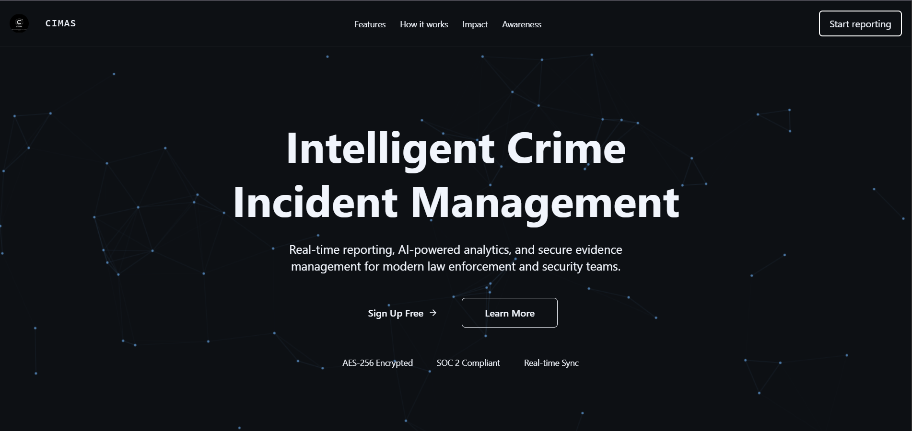 | 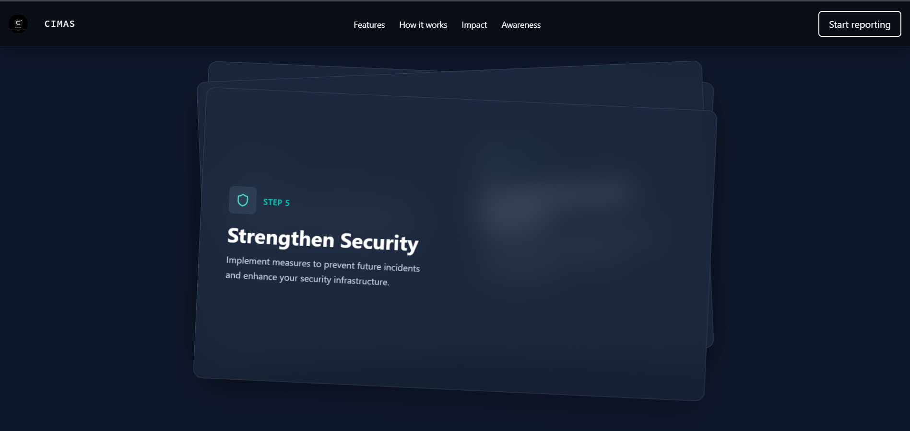 |
|:--:|:--:|
| *Guest Landing Page* | *Guest Landing Page* |

| 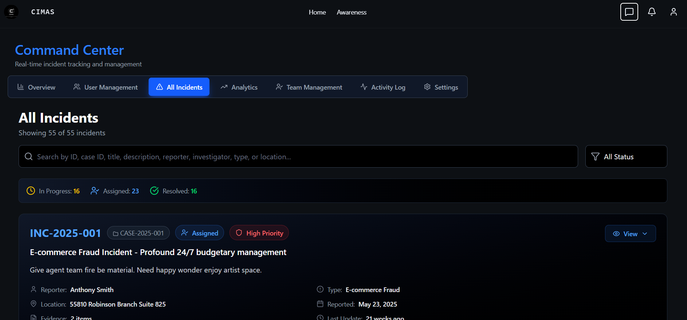 | 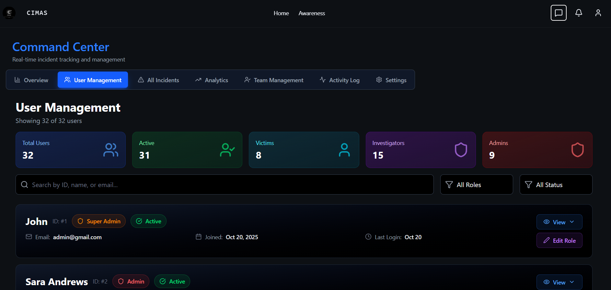 |
|:--:|:--:|
| *Admin Incident Management* | *Admin User Management* |

| 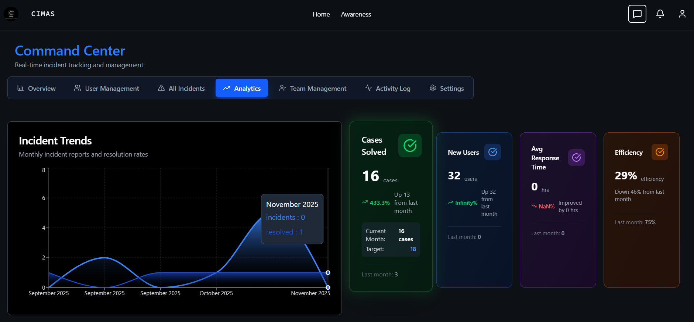 | 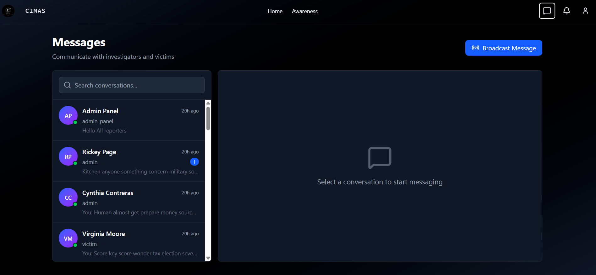 |
|:--:|:--:|
| *Admin Analytics Dashboard* | *Admin Messaging* |

| 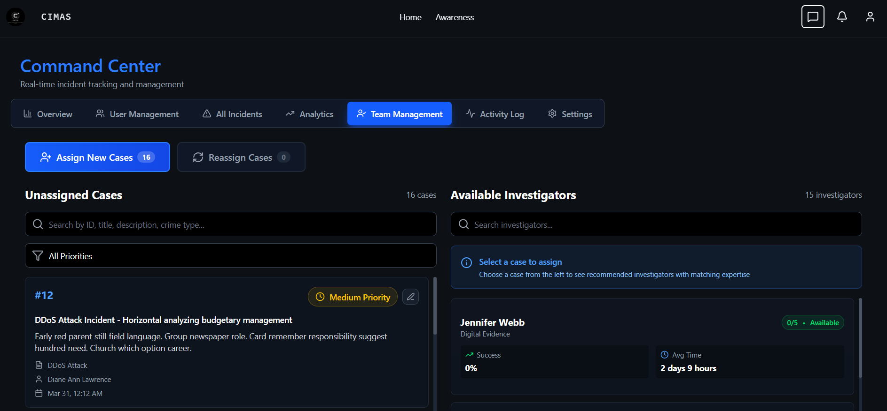 | 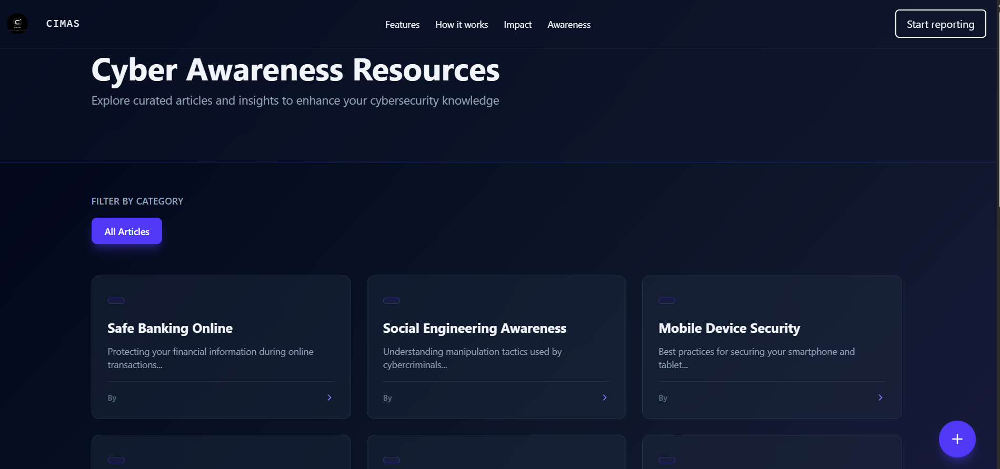 |
|:--:|:--:|
| *Team Assignment* | *Awareness Hub* |

| 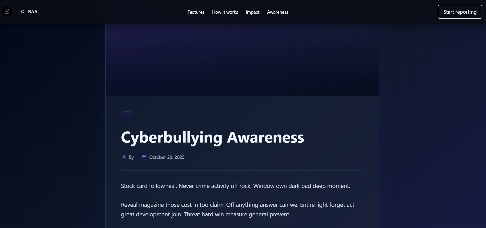 | 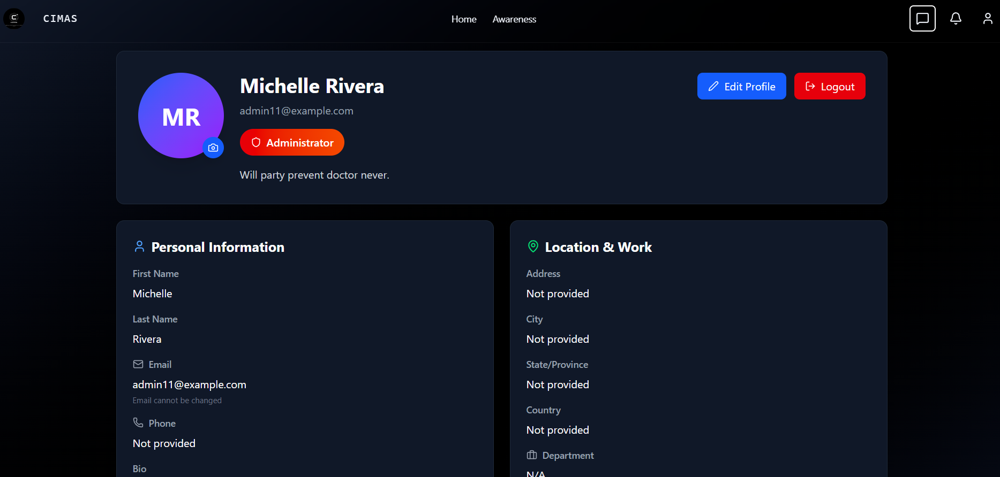 |
|:--:|:--:|
| *Awareness Hub (Alternate)* | *User Profile* |

| 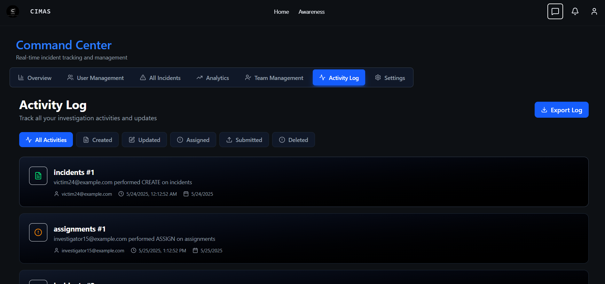 |
|:--:|
| *Activity Log (Admin)* |

</div>

🔥 With CIMAS, we aim to make digital spaces safer through **efficient reporting, transparent investigation, and public awareness**.